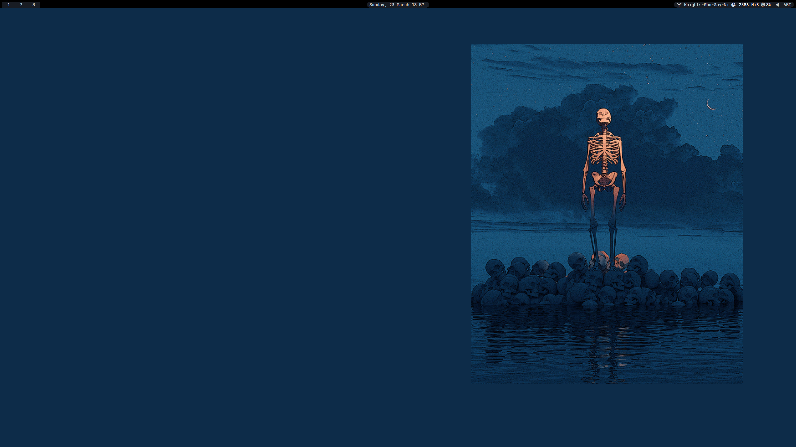

# dotfiles 
## :construction: under construction :construction:

## Usage

1. Install arch linux (i. e. using `archinstall`)
2. Update system `sudo pacman -Syu`
3. Install git `sudo pacman -S git`
4. Clone Reporsitory `git clone https://github.com/Kaesebrot84/dotfiles.git`
5. `cd dotfiles`
6. Run `bash install.sh`

## TODO

Install:
* `paru`
* `ripgrep`
* `betterlockscreen`
* `bluez`
* (optional) `flameshot`

